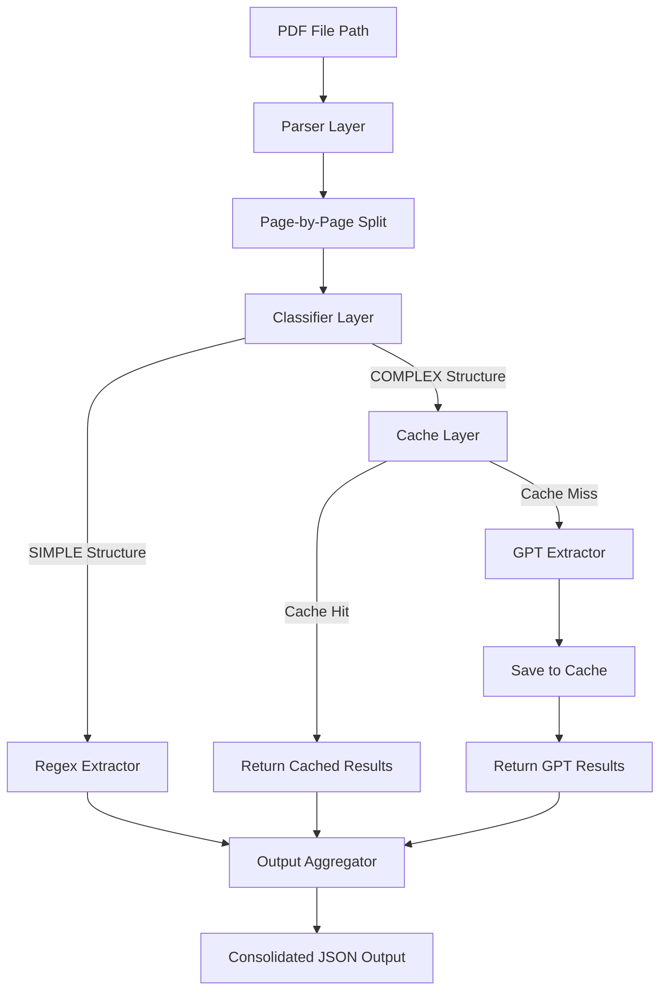

# Hybrid Tender Document Extractor

A modular TypeScript tool that extracts product information (name and quantity) from large government tender PDFs. It uses a hybrid extraction pipeline designed to minimize costs by intelligently routing simple pages to rule-based regex parsers and complex pages to GPT-4o-mini with local content caching.

---

## 🏗️ Architecture



---

## 🌟 Key Features

* **Smart Classification**: Analyzes page text density and keyword structure to distinguish between simple item lists and complex procurement clauses.
* **Hybrid Extraction**:
  * **Regex Parser**: Instantly extracts products from standard tables and lists for **$0**.
  * **OpenAI GPT-4o-mini**: Uses Structured Outputs (`openai.beta.chat.completions.parse`) to accurately pull products from complex, nested prose.
* **Cache-First Design**: Hashes page content to cache GPT results locally, avoiding redundant API costs on repeat runs.
* **Consolidation Engine**: Cleans product names and aggregates quantities across all pages.
* **Execution Report**: Prints run statistics detailing total pages, regex bypass counts, cache hit savings, and estimated API spend.

---

## 🛠️ Tech Stack

* **Runtime**: Node.js & TypeScript
* **Libraries**: `pdf-parse`, `openai`, `zod`, `dotenv`
* **Execution**: `tsx` (TypeScript Execute)

---

## 🚀 Quick Start

### 1. Installation
Clone the repository and install the dependencies:
```bash
npm install
```

### 2. Configuration
Create a `.env` file in the root directory (using `.env.example` as a guide) and add your OpenAI API Key:
```env
OPENAI_API_KEY=sk-proj-xxxxxxxxxxxxxxxxxxxxxxxx
CACHE_DIR=./.cache
LOG_LEVEL=info
```

### 3. Run Verification Tests
Verify all system parts are working:
```bash
# Run Classifier, Parser, and Cache tests
npx tsx src/classifier/testClassifier.ts
npx tsx src/parser/testParser.ts
npx tsx src/cache/testCache.ts

# Run the complete End-to-End integration test
npx tsx src/testE2E.ts
```

### 4. Run the Extractor
To extract products from a tender document:
```bash
npm run dev "path/to/tender.pdf"
```

To specify a custom output JSON file:
```bash
npm run dev "path/to/tender.pdf" "path/to/output.json"
```
